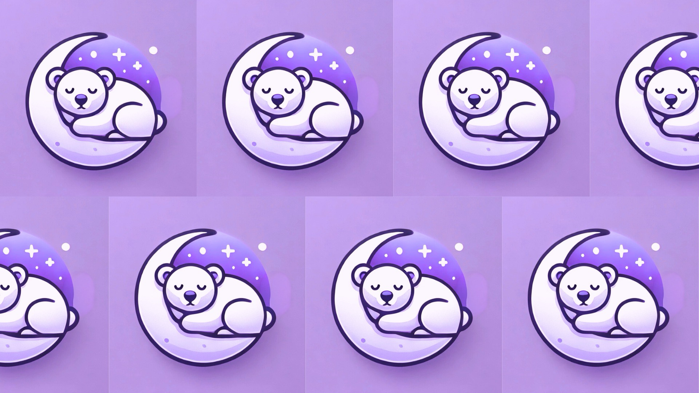

# Somnia (Hack WashU 2024)

  

## What is Somnia?

Somnia turns healthy sleep habits into a fun, competitive experience. Users can track their sleep scores and see how they rank among friends on a leaderboard. This unique keeps users motivated to maintain healthy habits over a long period of time. Beyond individual tracking, Somnia fosters community through friendly competition. This social interaction keeps users invested, making the app not just a sleep tracker but a platform for bonding over wellness. The app provides insights into users’ sleep patterns and their correlation to metrics like resting heart rate. The combination of these metrics into a sleep score helps users understand how small changes in their sleep improve overall health.

## Our Team

- Aaron Hubhachen
- Daniel Yoo
- Ethan Ng
- Luke Griggs

## Demo

Checkout our demo video [here](https://youtu.be/qB6SYfkAQzM) and our slides [here](https://docs.google.com/presentation/d/1rLOwCB5I9M5cd7j4Ystd1I80mAyuOf6DNAQqDtP6nss/edit?usp=sharing)!

## Award

Awarded 2nd place overall in the master's division.

## Credits

Huge thanks to [Hack WashU](https://hackwashu.com) for putting on such a great event! We had a blast coding this out, meeting people, and speaking with the companies that sponsored this event.

In addition to this, we are extremely grateful for [flemingvincent's Expo Supabase Template](https://github.com/flemingvincent/expo-supabase-starter) that we utilized as well as the [React Native Health library](https://github.com/agencyenterprise/react-native-health) which allowed us to easily interface with Apple Healthkit!
